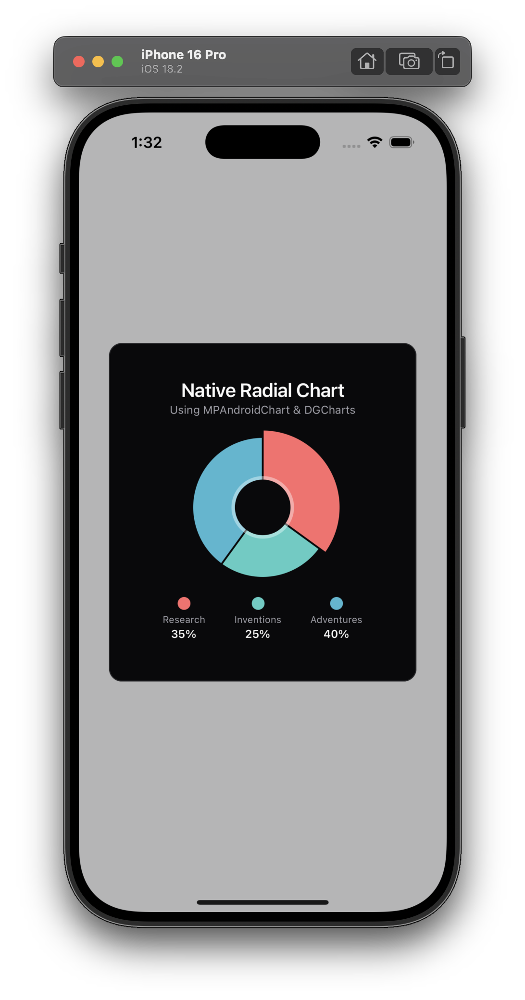
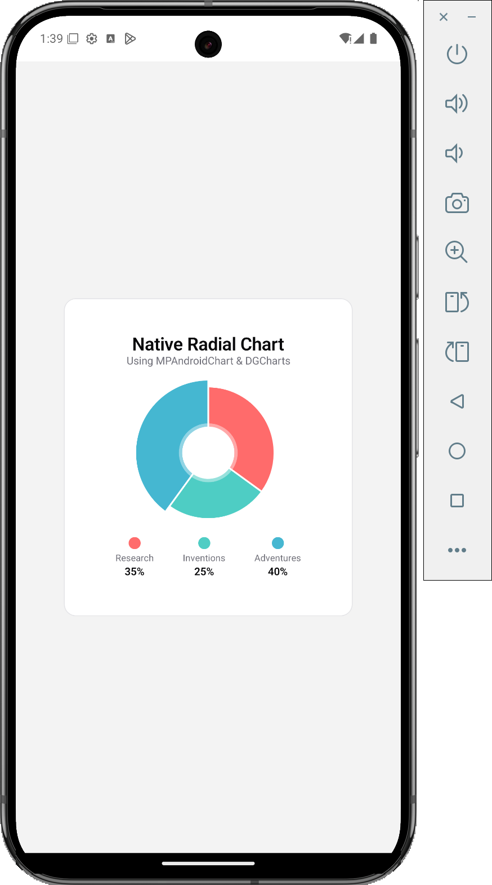

# Expo Native Module Development Guide

## 📱 Demo

Here's the interactive radial chart running on both platforms, built with the native module:

<div align="center">
  
  
</div>

_Interactive pie chart with segment selection, built using MPAndroidChart (Android) & DGCharts (iOS)_

### ✨ What You See in the Demo

- **Interactive Chart**: Tap any segment to select it
- **Visual Feedback**: Selected segments show highlighted indicators in the legend
- **Real-time Updates**: Tap the refresh button to generate new random data
- **Cross-Platform**: Same functionality works on both iOS and Android
- **Native Performance**: Smooth animations and touch handling via native libraries

### 🎯 Demo Features Highlighted

1. **Native Chart Rendering** - Using MPAndroidChart on Android, DGCharts on iOS
2. **Touch Interaction** - Native gesture handling
3. **Event Communication** - Native-to-React Native event emission
4. **TypeScript Integration** - Type-safe props and event handling
5. **Modern UI** - NativeWind styling with proper theming

## 📸 Screenshots

The demo shows the same radial chart running on both platforms with identical functionality:

**Android (left)** - Using MPAndroidChart library
**iOS (right)** - Using DGCharts library

Both implementations show three data segments:

- **Research** (35%) - Red segment
- **Inventions** (25%) - Teal segment
- **Adventures** (40%) - Blue segment

Each segment is interactive and provides visual feedback when selected. The chart uses native charting libraries for optimal performance and smooth animations on both platforms.

## 📖 About This Guide

This is a comprehensive guide for creating native modules using Expo Modules API. This example demonstrates wrapping third-party libraries (radial chart), but **these same steps work for ANY native code** - whether it's third-party libraries, custom native functionality, or platform-specific features.

## 🎯 What You Can Build

This guide works for creating **any type of native module**:

### 📦 Third-Party Library Wrappers

- Chart libraries (like an example)
- Camera/Video libraries
- Authentication SDKs
- Analytics SDKs
- Payment processors

### � Custom Native Functionality

- Device-specific features (sensors, hardware)
- File system operations
- Network protocols
- Custom UI components
- Performance-critical algorithms

### 🏗️ Platform-Specific Features

- iOS-only features (HealthKit, ARKit)
- Android-only features (Bluetooth Low Energy, NFC)
- Custom bridges to existing native code

## 🚀 Features

- **Production Ready**: Local modules work in production without publishing to NPM
- **Cross-Platform**: Same API, platform-specific implementations
- **Interactive**: Handle native events and user interactions
- **Event Handling**: Bidirectional communication between native and JS
- **No Ejection Required**: Uses Expo local modules (no need to eject)
- **TypeScript Support**: Full type safety
- **Modern Expo**: Works with Expo SDK 52+ and new architecture

## 📋 Prerequisites

### Basic Requirements

- Node.js 18+
- Expo CLI (`npm install -g @expo/cli`)

### iOS Development

- macOS with Xcode 14+
- CocoaPods (`sudo gem install cocoapods`)

### Android Development

- Android Studio with SDK 31+
- **Java Development Kit (JDK) 17** - Required for React Native development

#### ⚠️ Important: Java SDK Setup for Android

**Common Issue**: `No Java compiler found, please ensure you are running Gradle with a JDK`

**Solution for macOS (recommended)**:

```bash
# Install OpenJDK 17 using Homebrew
brew install openjdk@17

# Set up environment variables (add to ~/.zshrc or ~/.bash_profile)
echo 'export JAVA_HOME="/opt/homebrew/opt/openjdk@17"' >> ~/.zshrc
echo 'export PATH="/opt/homebrew/opt/openjdk@17/bin:$PATH"' >> ~/.zshrc

# Apply changes
source ~/.zshrc

# Verify installation
java -version  # Should show OpenJDK 17
echo $JAVA_HOME  # Should show the Java path
```

**Alternative installation methods**:

```bash
# Using SDKMAN (cross-platform)
curl -s "https://get.sdkman.io" | bash
sdk install java 17.0.15-tem

# Manual download from Oracle/OpenJDK
# Download JDK 17 from: https://adoptium.net/temurin/releases/
```

**Windows users**:

1. Download OpenJDK 17 from [Adoptium](https://adoptium.net/temurin/releases/)
2. Set `JAVA_HOME` environment variable to JDK installation path
3. Add `%JAVA_HOME%\bin` to your PATH

**Verify your setup**:

```bash
java -version  # Should show version 17.x.x
javac -version # Should show version 17.x.x
echo $JAVA_HOME # Should show path to JDK installation
```

## � Quick Start

To run this demo project:

```bash
# 1. Clone and install dependencies
git clone <your-repo-url>
cd expo-native
npm install

# 2. Set up Java for Android (if not already done)
brew install openjdk@17
echo 'export JAVA_HOME="/opt/homebrew/opt/openjdk@17"' >> ~/.zshrc
echo 'export PATH="/opt/homebrew/opt/openjdk@17/bin:$PATH"' >> ~/.zshrc
source ~/.zshrc

# 3. Generate native code
npx expo prebuild

# 4. Run on Android
npx expo run:android

# 5. Run on iOS (macOS only)
npx expo run:ios
```

## �🛠️ Universal Implementation Guide

### Step 1: Create Expo Project (if starting fresh)

```bash
# Create new Expo project
npx create-expo-app MyNativeModuleApp
cd MyNativeModuleApp

# Install dependencies
npm install
```

### Step 2: Initialize Local Expo Module

Create a local Expo module inside your existing project:

```bash
# Navigate to your project root
cd your-expo-project

# Create local module (replace with your module name)
npx create-expo-module --local your-module-name
```

**Important**: When prompted, choose these options:

- Module name: `your-module-name`
- Package name: `your-module-name`
- Description: `Interactive radial chart using native libraries`

This creates the directory structure:

```
modules/expo-radial-chart/
├── android/               # Android native code
├── ios/                  # iOS native code
├── src/                  # TypeScript/JavaScript code
├── expo-module.config.json
└── package.json
```

### Step 3: Add Dependencies (If Needed)

**Note**: This step is **only required if you're using third-party libraries**. For custom native code, you can skip to Step 4.

#### For Third-Party Libraries

If you're wrapping external libraries (like our chart example):

**Android Dependencies** - Edit `modules/your-module/android/build.gradle`:

```gradle
// Add repositories if needed (e.g., for Jitpack, Maven Central)
allprojects {
    repositories {
        maven { url 'https://jitpack.io' }  // Only if using Jitpack
    }
}

// ...existing code...

dependencies {
  implementation project(':expo-modules-core')
  implementation "org.jetbrains.kotlin:kotlin-stdlib-jdk7:${getKotlinVersion()}"
  // Add your third-party library
  implementation 'com.github.PhilJay:MPAndroidChart:v3.1.0'  // Example
}
```

**iOS Dependencies** - Edit `modules/your-module/ios/YourModule.podspec`:

```ruby
# ...existing code...

s.dependency 'ExpoModulesCore'
# Add your third-party library
s.dependency 'DGCharts', '~> 5.1.0'  # Example
```

#### For Custom Native Code

If you're writing custom native functionality, you typically only need:

```gradle
// Android - Usually just the basics
dependencies {
  implementation project(':expo-modules-core')
  implementation "org.jetbrains.kotlin:kotlin-stdlib-jdk7:${getKotlinVersion()}"
  // Add Android system APIs if needed
  implementation 'androidx.core:core-ktx:1.8.0'  // Example
}
```

```ruby
# iOS - Usually just the basics
s.dependency 'ExpoModulesCore'
# Add iOS system frameworks if needed
s.framework = 'CoreLocation'  # Example
```

### Step 4: Define TypeScript API

Update `modules/expo-radial-chart/src/ExpoRadialChart.types.ts`:

```typescript
import { ViewStyle } from "react-native/types";

export type SegmentSelectEventPayload = {
  index: number;
  percentage: number;
  color: string;
};

export type Series = {
  color: string;
  percentage: number;
};

export type ExpoRadialChartViewProps = {
  style?: ViewStyle;
  data: Series[];
  onSegmentSelect?: (event: SegmentSelectEventPayload) => void;
};
```

### Step 5: Implement Android Native Code

#### Android Module Definition

Update `modules/expo-radial-chart/android/src/main/java/expo/modules/radialchart/ExpoRadialChartModule.kt`:

```kotlin
package expo.modules.radialchart

import expo.modules.kotlin.modules.Module
import expo.modules.kotlin.modules.ModuleDefinition

class ExpoRadialChartModule : Module() {
  override fun definition() = ModuleDefinition {
    Name("ExpoRadialChart")

    View(ExpoRadialChartView::class) {
      Events("onSegmentSelect")

      Prop("data") { view: ExpoRadialChartView, prop: ArrayList<Series> ->
        view.setChartData(prop)
      }
    }
  }
}
```

#### Android Native View

Update `modules/expo-radial-chart/android/src/main/java/expo/modules/radialchart/ExpoRadialChartView.kt`:

```kotlin
package expo.modules.radialchart

import android.content.Context
import android.graphics.Color
import com.github.mikephil.charting.charts.PieChart
import com.github.mikephil.charting.data.PieData
import com.github.mikephil.charting.data.PieDataSet
import com.github.mikephil.charting.data.PieEntry
import com.github.mikephil.charting.highlight.Highlight
import com.github.mikephil.charting.listener.OnChartValueSelectedListener
import expo.modules.kotlin.AppContext
import expo.modules.kotlin.records.Field
import expo.modules.kotlin.records.Record
import expo.modules.kotlin.views.ExpoView
import expo.modules.kotlin.viewevent.EventDispatcher

class Series : Record {
  @Field
  val color: String = "#ff0000"
  @Field
  val percentage: Float = 0.0f
}

class ExpoRadialChartView(context: Context, appContext: AppContext) : ExpoView(context, appContext) {
  private var seriesData: ArrayList<Series> = ArrayList()
  val onSegmentSelect by EventDispatcher()

  internal val chartView = PieChart(context).also {
    it.layoutParams = LayoutParams(LayoutParams.MATCH_PARENT, LayoutParams.MATCH_PARENT)

    // Configure chart appearance
    it.description.isEnabled = false
    it.isDrawHoleEnabled = true
    it.setHoleColor(Color.TRANSPARENT)
    it.legend.isEnabled = false
    it.setTouchEnabled(true)
    it.isHighlightPerTapEnabled = true

    // Set up touch listener for interaction
    it.setOnChartValueSelectedListener(object : OnChartValueSelectedListener {
      override fun onValueSelected(e: com.github.mikephil.charting.data.Entry?, h: Highlight?) {
        val index = h?.x?.toInt() ?: return
        if (index < seriesData.size) {
          val series = seriesData[index]
          onSegmentSelect(mapOf(
            "index" to index,
            "percentage" to series.percentage,
            "color" to series.color
          ))
        }
      }
      override fun onNothingSelected() {}
    })

    addView(it)
  }

  fun setChartData(data: ArrayList<Series>) {
    seriesData = data
    val entries: ArrayList<PieEntry> = ArrayList()
    val colors: ArrayList<Int> = ArrayList()

    for (series in data) {
      entries.add(PieEntry(series.percentage))
      colors.add(Color.parseColor(series.color))
    }

    val dataSet = PieDataSet(entries, "DataSet")
    dataSet.colors = colors
    dataSet.setDrawValues(false)
    dataSet.sliceSpace = 2f
    dataSet.selectionShift = 8f

    val pieData = PieData(dataSet)
    chartView.data = pieData
    chartView.invalidate()
  }
}
```

### Step 6: Implement iOS Native Code

#### iOS Module Definition

Update `modules/expo-radial-chart/ios/ExpoRadialChartModule.swift`:

```swift
import ExpoModulesCore

public class ExpoRadialChartModule: Module {
  public func definition() -> ModuleDefinition {
    Name("ExpoRadialChart")

    View(ExpoRadialChartView.self) {
      Events("onSegmentSelect")

      Prop("data") { (view: ExpoRadialChartView, prop: [Series]) in
        view.setChartData(data: prop)
      }
    }
  }
}
```

#### iOS Native View

Update `modules/expo-radial-chart/ios/ExpoRadialChartView.swift`:

```swift
import ExpoModulesCore
import DGCharts

struct Series: Record {
  @Field
  var color: UIColor = UIColor.black
  @Field
  var percentage: Double = 0
}

class ExpoRadialChartView: ExpoView {
  let chartView = PieChartView()
  private var seriesData: [Series] = []
  let onSegmentSelect = EventDispatcher()

  required init(appContext: AppContext? = nil) {
    super.init(appContext: appContext)
    clipsToBounds = true

    // Configure chart appearance
    chartView.legend.enabled = false
    chartView.chartDescription.enabled = false
    chartView.holeRadiusPercent = 0.4
    chartView.transparentCircleRadiusPercent = 0.45
    chartView.drawHoleEnabled = true
    chartView.holeColor = UIColor.clear
    chartView.isUserInteractionEnabled = true
    chartView.rotationEnabled = false
    chartView.highlightPerTapEnabled = true

    chartView.delegate = self
    addSubview(chartView)
  }

  override func layoutSubviews() {
    chartView.frame = bounds
  }

  func setChartData(data: [Series]) {
    seriesData = data
    let set1 = PieChartDataSet(entries: data.map { series in
      return PieChartDataEntry(value: series.percentage)
    })
    set1.colors = data.map { series in
      return series.color
    }
    set1.drawValuesEnabled = false
    set1.sliceSpace = 2
    set1.selectionShift = 8

    let chartData: PieChartData = [set1]
    chartView.data = chartData
  }
}

// MARK: - ChartViewDelegate
extension ExpoRadialChartView: ChartViewDelegate {
  func chartValueSelected(_ chartView: ChartViewBase, entry: ChartDataEntry, highlight: Highlight) {
    let index = Int(highlight.x)
    if index < seriesData.count {
      let series = seriesData[index]

      // Convert UIColor to hex string
      var red: CGFloat = 0, green: CGFloat = 0, blue: CGFloat = 0, alpha: CGFloat = 0
      series.color.getRed(&red, green: &green, blue: &blue, alpha: &alpha)
      let hexColor = String(format: "#%02X%02X%02X",
                           Int(red * 255), Int(green * 255), Int(blue * 255))

      onSegmentSelect([
        "index": index,
        "percentage": series.percentage,
        "color": hexColor
      ])
    }
  }

  func chartValueNothingSelected(_ chartView: ChartViewBase) {}
}
```

### Step 7: Update React Component Wrapper

Update `modules/expo-radial-chart/src/ExpoRadialChartView.tsx`:

```tsx
import { requireNativeView } from "expo";
import * as React from "react";
import { ExpoRadialChartViewProps } from "./ExpoRadialChart.types";

const NativeView: React.ComponentType<ExpoRadialChartViewProps> =
  requireNativeView("ExpoRadialChart");

export default function ExpoRadialChartView(props: ExpoRadialChartViewProps) {
  const { onSegmentSelect, ...otherProps } = props;

  const handleSegmentSelect = (event: any) => {
    onSegmentSelect?.(event.nativeEvent);
  };

  return <NativeView {...otherProps} onSegmentSelect={handleSegmentSelect} />;
}
```

### Step 8: Export from Module Index

Update `modules/expo-radial-chart/index.ts`:

```typescript
export { default as ExpoRadialChartView } from "./src/ExpoRadialChartView";
export * from "./src/ExpoRadialChart.types";
```

### Step 9: Use in Your React Native App

Import and use the component in your app (e.g., `app/index.tsx`):

```tsx
import React, { useState } from "react";
import { View } from "react-native";
import { ExpoRadialChartView } from "../modules/expo-radial-chart";

export default function App() {
  const [selectedSegment, setSelectedSegment] = useState<number | null>(null);

  const chartData = [
    { color: "#ff6b6b", percentage: 35 },
    { color: "#4ecdc4", percentage: 25 },
    { color: "#45b7d1", percentage: 40 },
  ];

  function handleSegmentSelect(event: {
    index: number;
    percentage: number;
    color: string;
  }) {
    setSelectedSegment(event.index);
    console.log("Segment selected:", event);
  }

  return (
    <View style={{ flex: 1, justifyContent: "center", alignItems: "center" }}>
      <ExpoRadialChartView
        style={{ width: 200, height: 200 }}
        data={chartData}
        onSegmentSelect={handleSegmentSelect}
      />
    </View>
  );
}
```

### Step 10: Build and Test

```bash
# Generate native code
npx expo prebuild

# Build and run on iOS
npx expo run:ios

# Build and run on Android
npx expo run:android
```

## 📦 Production Deployment Options

### ✅ Option 1: Local Module (Production Ready)

Your module is already set up as a local module in `modules/your-module-name/`. **This is fully production-ready** and perfect for:

- ✅ **Production apps** - No need to publish to NPM
- ✅ **Single project use** - Keep code in your repo
- ✅ **Rapid development** - Instant changes without publishing
- ✅ **Private/proprietary code** - No external dependencies
- ✅ **Enterprise apps** - Complete control over the module
- ✅ **App Store/Play Store** - Ready for deployment

**Key Benefits:**

- **Zero external dependencies** - Everything is in your codebase
- **Full version control** - Module code is part of your Git repo
- **Instant updates** - No need to publish/install when making changes
- **Security** - No risk of supply chain attacks from external packages
- **Compliance** - Easier to audit for enterprise/regulated environments

### 📤 Option 2: Standalone NPM Package (For Sharing)

Only create a standalone package if you want to share across multiple projects:

#### Create Standalone Module

```bash
# Create a new standalone module
npx create-expo-module your-module-package

# Copy your implementation
cp -r modules/your-module-name/* your-module-package/
```

#### Publish to NPM

```bash
cd your-module-package

# Update package.json with your details
npm version 1.0.0

# Publish to NPM
npm publish
```

#### Use in Other Projects

```bash
# Install in any Expo project
npm install expo-radial-chart-package

# Add to plugins in app.json
{
  "expo": {
    "plugins": ["expo-radial-chart-package"]
  }
}
```

## 🔧 Essential Commands

```bash
# Module Development
npx create-expo-module --local <module-name>  # Create local module
npx create-expo-module <module-name>          # Create standalone module

# Building & Testing
npx expo prebuild                             # Generate native code
npx expo prebuild --clean                     # Clean rebuild
npx expo run:ios                             # Build for iOS
npx expo run:android                         # Build for Android

# iOS Specific
cd ios && pod install                         # Install iOS dependencies
cd ios && pod install --repo-update           # Update pod repos
xcodebuild clean                              # Clean iOS build

# Android Specific
cd android && ./gradlew clean                 # Clean Android build

# Development
npx expo start                                # Start development server
npx expo start --clear                       # Start with cleared cache
```

## 🌍 Universal Application - Any Native Code

### These Steps Work For ANY Native Implementation

The exact same pattern works whether you're:

#### 📦 Wrapping Third-Party Libraries

```bash
# Chart libraries (our example)
npx create-expo-module --local expo-charts
# Camera libraries
npx create-expo-module --local expo-advanced-camera
# Payment SDKs
npx create-expo-module --local expo-stripe-native
```

#### 🔧 Building Custom Native Features

```bash
# Device sensors
npx create-expo-module --local expo-custom-sensors
# File operations
npx create-expo-module --local expo-secure-storage
# Bluetooth connectivity
npx create-expo-module --local expo-ble-manager
```

#### 🏗️ Platform-Specific Functionality

```bash
# iOS HealthKit integration
npx create-expo-module --local expo-health-data
# Android NFC reader
npx create-expo-module --local expo-nfc-reader
# Custom authentication
npx create-expo-module --local expo-biometric-auth
```

### Example Use Cases

#### 1. Custom Device Feature

```kotlin
// Android: Access hardware sensors
class CustomSensorView : ExpoView {
  private val sensorManager = context.getSystemService(Context.SENSOR_SERVICE) as SensorManager

  fun startSensorReading() {
    // Your custom sensor logic
    onSensorData(mapOf("value" to sensorValue))
  }
}
```

#### 2. Platform-Specific API

```swift
// iOS: CoreLocation integration
class LocationTrackerView: ExpoView {
  let locationManager = CLLocationManager()

  func requestLocation() {
    // Your custom location logic
    onLocationUpdate(["latitude": lat, "longitude": lng])
  }
}
```

#### 3. Performance-Critical Code

```kotlin
// Android: Custom image processing
class ImageProcessorView : ExpoView {
  fun processImage(imageData: ByteArray): ByteArray {
    // Your high-performance native image processing
    return processedData
  }
}
```

### The Pattern is Always the Same

1. **Create module**: `npx create-expo-module --local your-feature`
2. **Define types**: Create TypeScript interfaces
3. **Implement Android**: Write Kotlin code in `ExpoView`
4. **Implement iOS**: Write Swift code in `ExpoView`
5. **Handle events**: Use `EventDispatcher` for communication
6. **Export & use**: Import in your React Native app

**✅ Production Ready**: Whether third-party library or custom code, local modules work in production without any NPM publishing required.

## 🔍 Troubleshooting

### Common Issues

- **Build Errors**: Run `npx expo prebuild --clean` to regenerate native code
- **iOS Dependency Issues**: Run `cd ios && pod install --repo-update`
- **Android Dependency Issues**: Check that Jitpack repository is added correctly
- **Event Not Firing**: Ensure `Events("eventName")` matches `EventDispatcher` property name
- **Module Not Found**: Make sure module is properly exported in `index.ts`
- **TypeScript Errors**: Ensure proper type definitions in `.types.ts` file

### Debug Commands

```bash
# Clear all caches and rebuild
npx expo prebuild --clean
npx expo start --clear

# iOS specific debugging
cd ios && pod install --repo-update
cd ios && xcodebuild clean

# Android specific debugging
cd android && ./gradlew clean
cd android && ./gradlew build

# Check module structure
ls -la modules/expo-radial-chart/
```

### Platform-Specific Issues

#### iOS

- Ensure Xcode is up to date (14+)
- Check CocoaPods version: `pod --version`
- Verify DGCharts dependency in podspec

#### Android

- Ensure Android SDK 31+ is installed
- Check Gradle version compatibility
- Verify MPAndroidChart dependency and Jitpack repository

## 🚀 What You've Learned

By following this guide, you've successfully:

1. ✅ **Created a production-ready local module** without ejecting or publishing to NPM
2. ✅ **Learned universal patterns** that work for ANY native code (third-party or custom)
3. ✅ **Implemented cross-platform native views** with touch interaction
4. ✅ **Used modern Events API** for native-to-JS communication
5. ✅ **Built a deployable solution** ready for App Store and Google Play
6. ✅ **Handled platform-specific development** in Kotlin and Swift

## 🏭 Production Deployment Confidence

### ✅ Your Local Module is Production Ready

**Important**: You do NOT need to publish to NPM for production use. Your local module:

- ✅ **Builds into your app binary** - becomes part of your compiled app
- ✅ **Works in production builds** - same as any other app code
- ✅ **Passes App Store review** - no different from native app code
- ✅ **Has zero external dependencies** - completely self-contained
- ✅ **Supports over-the-air updates** - if your JS layer changes
- ✅ **Works with EAS Build** - full Expo cloud build support

### 🔄 When You DO Need NPM Publishing

Only publish to NPM if you want to:

- Share across multiple projects
- Open source your module
- Create a library for the community
- Manage versions independently

**For single-app use, local modules are the recommended approach.**

## � Troubleshooting

### Common Build Issues

#### Android Build: "No Java compiler found"

**Error**:

```
Error resolving plugin [id: 'com.facebook.react.settings']
No Java compiler found, please ensure you are running Gradle with a JDK
```

**Solution**: Install and configure JDK 17 (see Prerequisites section above)

#### Android Build: Package.json not found

**Error**:

```
ConfigError: The expected package.json path: /path/to/android/package.json does not exist
```

**Solution**:

1. Ensure your custom module has a `package.json` file
2. Add your module to main `package.json` dependencies:

```json
{
  "dependencies": {
    "your-module-name": "file:./modules/your-module-name"
  }
}
```

#### iOS Build: CocoaPods issues

**Error**: Pod installation failures

**Solution**:

```bash
# Clean and reinstall pods
cd ios && rm -rf Pods Podfile.lock
cd .. && npx expo install --fix
npx expo run:ios
```

#### Build Performance Issues

**Solution**:

```bash
# Clear all caches
npm run clean  # If you have this script
rm -rf node_modules
npm install

# Clear Expo cache
npx expo start -c

# Clear React Native cache
npx react-native start --reset-cache
```

### Git and Version Control

#### Divergent branches error

**Error**:

```
hint: You have divergent branches and need to specify how to reconcile them
```

**Solution**:

```bash
# Set merge strategy (recommended for most cases)
git config pull.rebase false

# Pull and merge
git pull

# Push your changes
git push
```

## �📚 Further Reading

- [Expo Modules API Documentation](https://docs.expo.dev/modules/module-api/)
- [Third-Party Library Wrapping Guide](https://docs.expo.dev/modules/third-party-library/)
- [MPAndroidChart Documentation](https://github.com/PhilJay/MPAndroidChart)
- [DGCharts Documentation](https://github.com/danielgindi/Charts)
- [Expo Local Modules Guide](https://docs.expo.dev/modules/get-started/)
- [React Native New Architecture](https://reactnative.dev/docs/the-new-architecture/landing-page)

## 🎯 Next Steps

### For Chart Module Enhancement

- Add more chart customization options (colors, animations, etc.)
- Implement additional chart types (line charts, bar charts)
- Add accessibility features
- Create comprehensive test suite

### For Any Native Module Development

- **Custom Device Features**: Sensors, camera, microphone, GPS
- **Platform APIs**: HealthKit (iOS), Google Fit (Android), NFC, Bluetooth
- **Performance Features**: Image processing, video encoding, ML inference
- **Security Features**: Biometric authentication, secure storage, encryption
- **Third-Party SDKs**: Analytics, payments, social media, advertising

### Publishing Options

- **Keep Local** (Recommended): For production apps, single-project use
- **Publish to NPM**: Only if sharing across multiple projects or open-sourcing

## 📄 License

This project is licensed under the MIT License.

---

## 💡 Pro Tips

1. **Always use local modules** for initial development - faster iteration
2. **Test on both platforms early** - catch platform-specific issues quickly
3. **Follow Expo's Events pattern** - more maintainable than callback props
4. **Use TypeScript** - better developer experience and fewer runtime errors
5. **Start simple** - add complexity gradually as you understand the APIs

Happy coding! 🎉
